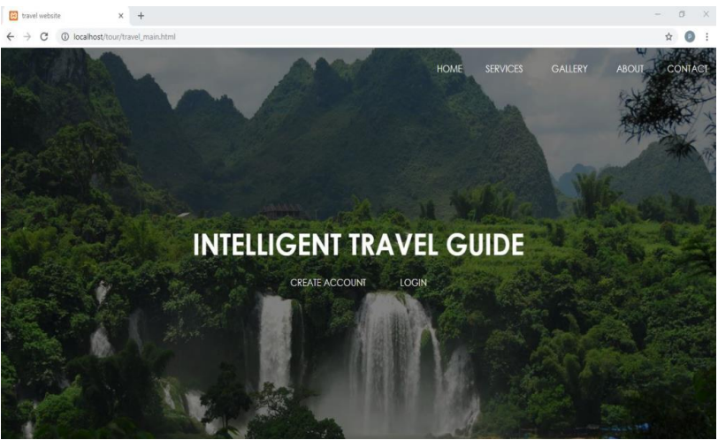
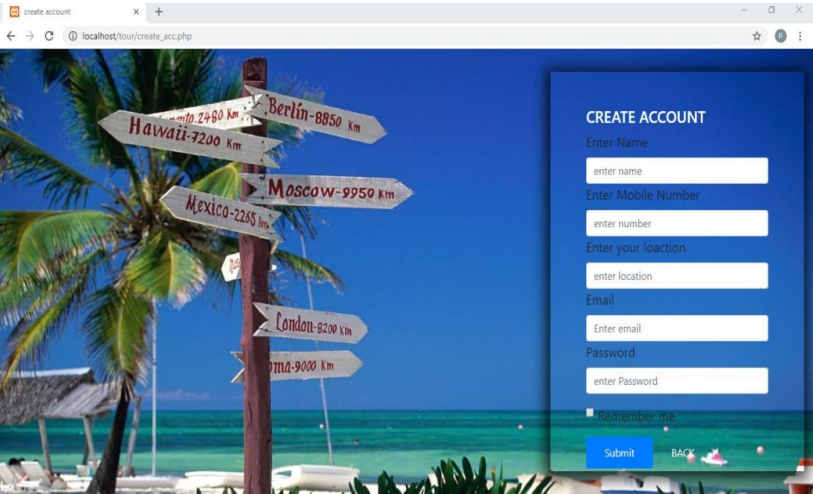
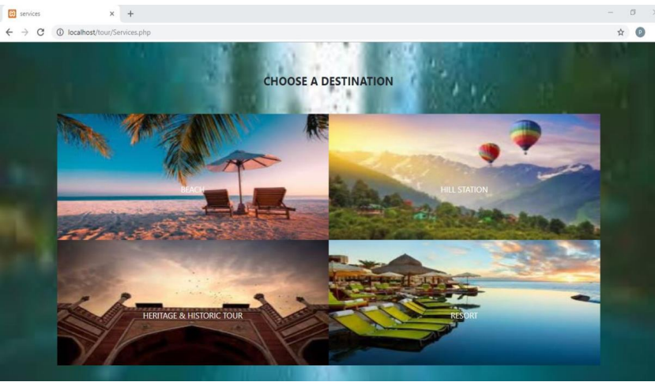
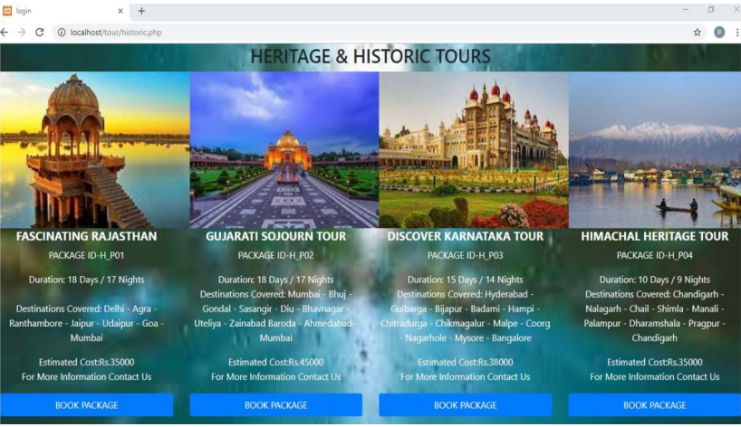
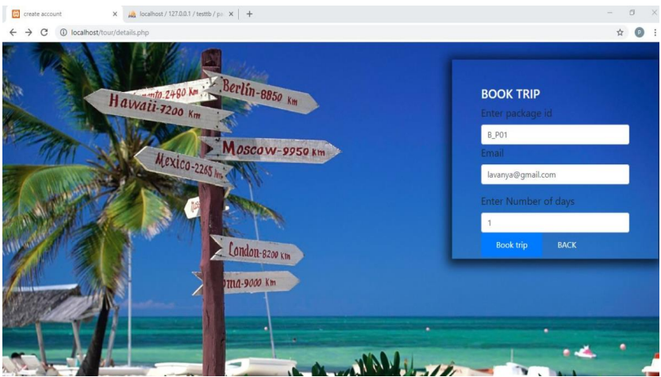
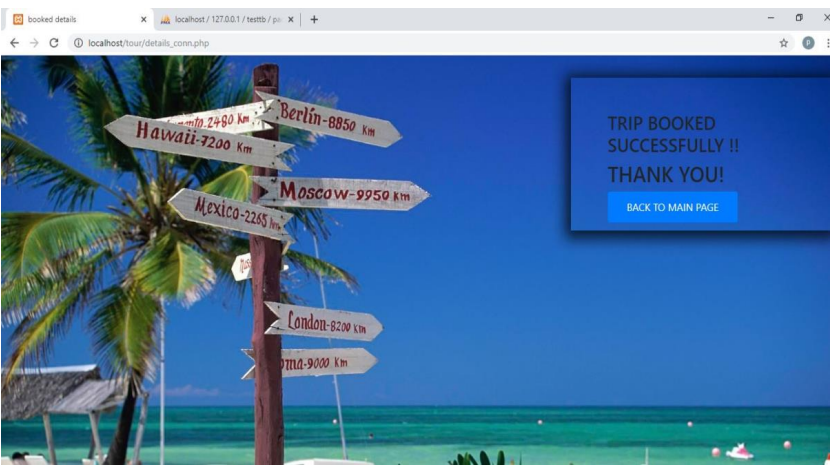

### Description

The project is developed to give users a very interactive interface.There are two entities who will have the accessto the system.One is the admin and another will be the registered user. Admin will manage places with details such as place,name,image,address,area,destination type and its description. Admin can view all the bookings. User will have to create unique account and login to the account. After login uset can select the destination and view its details. Based on the destination they can choose the place and book the tour. 

### Application screens

#### travel_main.html

### Features

- Fully Responsive
- Multi-Page Layout
- Bootstrap
- HTML,CSS,PHP

### screenshots

### Thanks

If you like this project don't forget give it a ⭐ 
